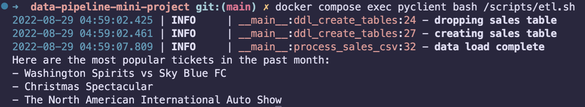

# Data pipeline mini project - Event Ticket System Case Study

this project requires the user to have docker / docker compose installed

## Outcomes

1. Write DDL and use it to create sales table [ddl.py](./client/src/ddl.py)
2. Read the CSV file and load the new sales records into the ticket sales table [seed.py](./client/src/seed.py)
3. Print report for most popular events [report.py](./client/src/report.py)

## initial setup

- create `.env` file from copy of `.env.example`
- set the values you want to use for the env variables 

```bash
cp .env.example .env
```
- `.env` contents
  - `MYSQL_RANDOM_ROOT_PASSWORD=yes` : root user will not be used
  - `DATABASE_NAME: springboardopt` : database name
  - `DATABASE_USER: oort` : database user
  - `DATABASE_PASSWORD: oort.secret` database secret
  - `DATABASE_HOST: mysqldb` database host name or ip address - default value is the docker compose service name for mysql

- ensure no instance of project is running running the compse `down` command

```bash
docker compose down -v
```

- build and spin up mysql database and client

```bash
docker compose up --build -d
```

- you want to make sure the database is ready for connection so you need to pull the docker logs
- verify mysql database is ready for connections, you should see the database logs showing `ready for connections`


```bash
docker compose logs mysqldb --follow
```

## Usage Example

- do the initial setup first
- user should be able to create table, seed table with data, and generate report by running `etl.sh`



```bash
bash scripts/etl.sh
```


